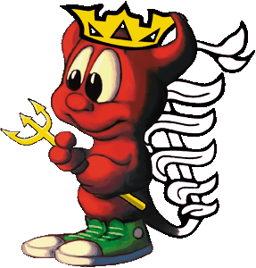

   &nbsp;&nbsp;&nbsp;&nbsp;&nbsp;&nbsp;&nbsp;&nbsp;&nbsp;&nbsp;&nbsp;
  <i><h2>Arthur / Rthxr</h2></i>
  <i>Information security enthusiast and amateur researcher</i>  
  <i>Hub focused in Malware Analysis, development and others..  
     Also exploits, DKOM, security tools and elf exercises  
  <i><b>#Malware #Security #Exploitation</b></i>

<!--
**rthxr/rthxr** is a ✨ _special_ ✨ repository because its `README.md` (this file) appears on your GitHub profile.

Here are some ideas to get you started:

- 🔭 I’m currently working on ...
- 🌱 I’m currently learning ...
- 👯 I’m looking to collaborate on ...
- 🤔 I’m looking for help with ...
- 💬 Ask me about ...
- 📫 How to reach me: ...
- 😄 Pronouns: ...
- ⚡ Fun fact: ...
-->
